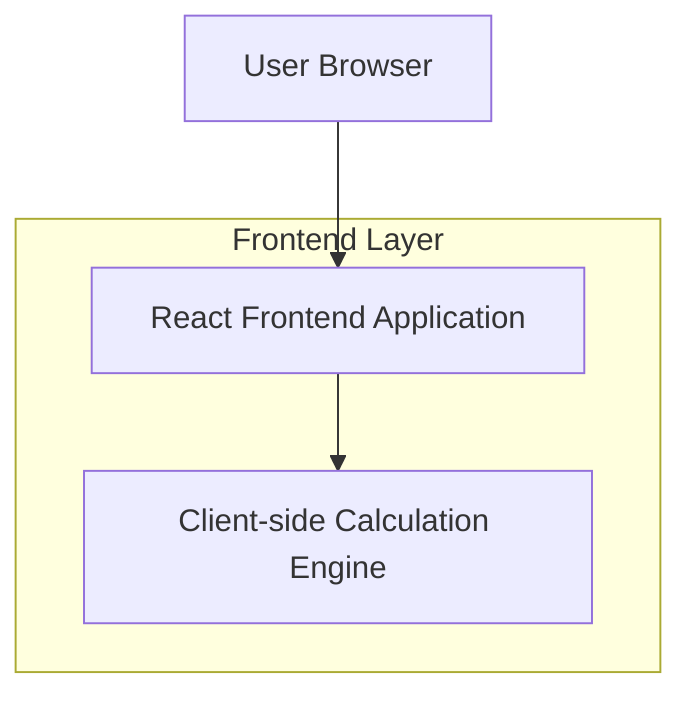

## 1.Architecture design

## 2.Technology Description
- Frontend: React@18 + TypeScript + vite + tailwindcss@3
- Backend: None (kalkulasi berjalan di client)

## 3.Route definitions
| Route | Purpose |
|-------|---------|
| / | Halaman kalkulator untuk input parameter dan melihat hasil perhitungan |
